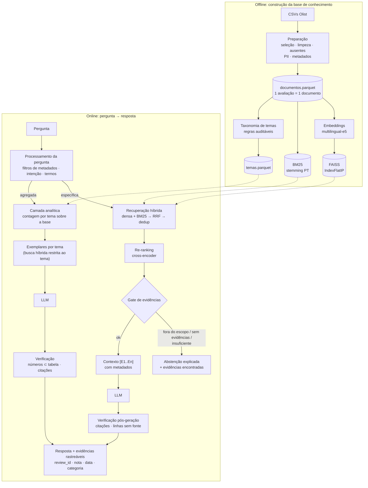

# Voice of Customer Intelligence com RAG — Olist

Solução do **Tech Challenge da Fase 4 (Deep Learning and NLP)** da Pós-Tech AI Scientist (FIAP).

O sistema transforma ~42 mil avaliações escritas por clientes da Olist numa base de conhecimento consultável em linguagem natural. Gestores e analistas perguntam ("quais são os principais problemas relatados?", "o que os clientes dizem sobre entregas atrasadas em SP?") e recebem respostas **fundamentadas em avaliações reais**, com as evidências exibidas e rastreáveis até o `review_id`. Quando a base não sustenta uma resposta, o sistema **diz que não sabe** em vez de inventar.

| | |
|---|---|
| **Equipe** | Grupo 99<br>Gustavo Schilling Schutt — gustaschutt@hotmail.com<br>Tainá Julianotti — tainajulianotti@hotmail.com<br>Wilker Ferreira Cunha — wilker.ferreiracunha@gmail.com |
| **Vídeo** | _preencher: link do vídeo (até 5 min)_ |
| **Dataset** | [Brazilian E-Commerce Public Dataset by Olist](https://www.kaggle.com/datasets/olistbr/brazilian-ecommerce) (CC BY-NC-SA 4.0) |

## Para o avaliador

Três formas de verificar o projeto, da mais rápida para a mais completa:

| Caminho | O que fazer | Precisa de |
|---|---|---|
| **1. Ler os resultados** | Abrir aqui no GitHub os notebooks [01](notebooks/01_eda_e_preparacao.ipynb)–[04](notebooks/04_camada_analitica.ipynb) (já executados, com saídas), as métricas em [`docs/resultados_avaliacao.md`](docs/resultados_avaliacao.md) e as respostas literais do sistema em [`docs/exemplos_perguntas_respostas.md`](docs/exemplos_perguntas_respostas.md). Os dois relatórios e os notebooks 02 e 03 registram no topo a configuração usada (embeddings, reranker e LLM). | nada |
| **2. Executar sem chave de API** | Rodar o pipeline com LLM local (`LLM_PROVIDER=hf`, padrão do `.env.example`) ou sem LLM (`LLM_PROVIDER=extractive`, ou `run_all.py --sem-llm`). | Python 3.12 ou 3.13 e internet (os modelos de embeddings e reranker são baixados do Hugging Face na primeira execução) |
| **3. Executar com o LLM de API** (configuração dos resultados publicados) | Criar uma chave no [Google AI Studio](https://aistudio.google.com/apikey) e preencher no `.env`: `LLM_PROVIDER=gemini`, `LLM_MODEL=gemini-3.8-flash`, `GEMINI_API_KEY=<sua chave>`. Algumas perguntas avulsas cabem na cota gratuita. A execução completa faz dezenas de chamadas, e a cota diária do plano gratuito é baixa (o erro 429 que recebemos indicava 20 requisições por dia para esse modelo). Para rodar tudo de uma vez, ative o faturamento no projeto do Google Cloud ligado à chave. | conta Google |

**Os dados já estão no repositório.** Os 6 arquivos do dataset usados pelo pipeline estão em [`data/raw/`](data/raw), compactados (`.csv.gz`, ~25 MB). O código lê esse formato direto, sem descompactar, e não é preciso baixar nada do Kaggle. A licença e a atribuição estão em [`data/README.md`](data/README.md).

**Nenhuma chave de API está no repositório.** O arquivo `.env` é ignorado pelo Git; cada pessoa usa a sua própria chave ou um dos modos sem chave. Executar os scripts regenera `eval/resultados/`, `docs/` e os notebooks com a configuração de quem executa, substituindo os resultados publicados (`--sem-llm` regrava o relatório sem a parte ponta a ponta). Para comparar, rode numa cópia do repositório.

```bash
# Caminho 2 (Windows; no Linux/Mac use "source .venv/bin/activate" e "cp")
python -m venv .venv
.venv\Scripts\activate
pip install torch
pip install -r requirements.txt
copy .env.example .env              # padrão: LLM local, sem chave
pytest -q                           # testes automatizados (segundos, sem downloads)
python scripts/run_all.py --sem-llm # sem LLM: base, índice, temas, calibração e avaliação de recuperação/gate
python scripts/run_all.py           # pipeline completo, com o LLM configurado no .env
streamlit run app/streamlit_app.py  # interface
```

---

## Sumário

1. [Problema de negócio](#1-problema-de-negócio)
2. [Arquitetura](#2-arquitetura)
3. [Preparação da base de conhecimento](#3-preparação-da-base-de-conhecimento)
4. [Pipeline RAG](#4-pipeline-rag)
5. [Respostas sem evidência suficiente](#5-respostas-sem-evidência-suficiente)
6. [Camada analítica para perguntas agregadas](#6-camada-analítica-para-perguntas-agregadas)
7. [Avaliação](#7-avaliação)
8. [Exemplos de perguntas e respostas](#8-exemplos-de-perguntas-e-respostas)
9. [Instalação e execução](#9-instalação-e-execução)
10. [Estrutura do repositório](#10-estrutura-do-repositório)
11. [Tecnologias](#11-tecnologias)
12. [Principais decisões técnicas](#12-principais-decisões-técnicas)
13. [Limitações conhecidas](#13-limitações-conhecidas)

---

## 1. Problema de negócio

A nota de uma avaliação diz **quanto** o cliente ficou satisfeito, mas não **por quê**. O porquê está no texto, e ler milhares de comentários à mão não escala. A empresa precisa responder rapidamente:

- quais são os principais motivos de insatisfação, e com que frequência aparecem;
- o que os clientes mais valorizam;
- que padrões existem em entrega, qualidade do produto e atendimento;
- **quais avaliações sustentam** cada uma dessas conclusões.

A última pergunta orienta todo o projeto: um insight sem evidência não serve para decisão. Por isso a solução foi construída para que cada afirmação da resposta aponte para avaliações reais, e para que o sistema recuse responder quando os dados não permitem.

## 2. Arquitetura



Os detalhes de cada módulo estão em [`docs/arquitetura.md`](docs/arquitetura.md).

## 3. Preparação da base de conhecimento

A análise exploratória completa, com os gráficos que justificam cada decisão, está em [`notebooks/01_eda_e_preparacao.ipynb`](notebooks/01_eda_e_preparacao.ipynb). Código: [`src/voc_rag/data_prep.py`](src/voc_rag/data_prep.py).

| Etapa | Decisão | Por quê |
|---|---|---|
| **Seleção** | Entram no índice as avaliações com título **ou** comentário (42.138 documentos). Todas as 98.410 avaliações únicas ficam numa base separada, usada nas estatísticas. | Só texto pode ser recuperado. Proporções, porém, precisam da base inteira. |
| **Ausentes** | Avaliação sem texto fica fora do índice. Título ausente: usa-se só o comentário (e só o título, quando é o que existe: 1.729 avaliações no dado bruto). Entrega sem data vira situação "não entregue". Produto sem categoria vira `sem_categoria`; pedido sem itens na tabela de itens vira `sem_itens` (509 documentos). | Nada é imputado no texto, e cada caso tem tratamento explícito. |
| **Viés de quem comenta** | Avaliações de nota 1 têm texto em 77% dos casos; as de nota 4–5, em cerca de 33% a 38%. Na camada analítica, os percentuais são calculados dentro de bases declaradas. | A base textual sobrerrepresenta a insatisfação. |
| **Documento** | 1 avaliação = 1 documento (título + comentário), **sem chunking**. | A mediana é de 9 palavras; o comentário mais longo tem 208 caracteres (229 com o título). Cortar destruiria o sentido e a rastreabilidade. |
| **Duplicidade** | `review_id` repetido (814 linhas: mesmo texto e nota em 2–3 pedidos) vira um documento só, com a lista de pedidos. Textos idênticos (17% dos documentos; por exemplo, "ótimo" 593× e "muito bom" 590×, ignorando caixa, acento e pontuação) são mantidos, mas deduplicados na recuperação. | Não inflar o contexto do LLM nem perder contagens. |
| **Limpeza** | Para os embeddings, limpeza mínima: Unicode NFC, quebras de linha e espaços. Para o BM25, limpeza pesada: minúsculas, sem acento, stopwords e stemming Snowball, **preservando negações** ("não", "nunca", "sem"). | Transformers usam acento, caixa e negação como sinal. O BM25 precisa casar termos. |
| **Privacidade** | Telefones, e-mails, CPFs e URLs mascarados (`[TELEFONE]`...). | Dado pessoal não deve chegar ao LLM nem aparecer na resposta. |
| **Metadados** | Nota, data da compra, categoria (item de maior valor, mais a lista completa), UF do cliente, situação da entrega e dias de atraso. Número de itens e de vendedores, valores e status do pedido também ficam na base, mas nesta versão não são usados em filtros nem contagens (o notebook 04 usa número de itens e de vendedores para testar uma hipótese). | Servem para filtrar a busca, contextualizar a evidência e segmentar contagens. O atraso tem forte relação com a nota (notebook 01, seção 6). |
| **Embeddings** | `intfloat/multilingual-e5-base` (768 dim.), com prefixos `query:` e `passage:`, vetores normalizados. | Modelo multilíngue de recuperação assimétrica (pergunta curta × documento) que roda em CPU. A comparação com o baseline clássico (LSA), o MiniLM e o e5-small está na seção 7. |
| **Indexação** | FAISS `IndexFlatIP` (busca **exata**) com pré-filtragem por metadados (`IDSelector`), mais BM25 em memória. | Com 42 mil vetores a busca exata custa milissegundos. Índice aproximado (HNSW/IVF) só compensaria na casa dos milhões. |

## 4. Pipeline RAG

Código: [`src/voc_rag/pipeline.py`](src/voc_rag/pipeline.py). Passo a passo com saídas reais: [`notebooks/02_pipeline_rag_passo_a_passo.ipynb`](notebooks/02_pipeline_rag_passo_a_passo.ipynb).

1. **Transformação da pergunta** ([`query.py`](src/voc_rag/query.py)). Regras explícitas extraem **filtros de metadados**: "insatisfeitos" vira nota ≤ 2, "em 2018" vira período, "móveis" vira categorias `moveis_*`, "SP" vira UF e "pedidos entregues com atraso" vira situação da entrega. As regras também detectam a **intenção** (pergunta agregada ou específica) e isolam os **termos de conteúdo**. Os filtros inferidos são devolvidos ao usuário, que pode corrigi-los na interface. A escolha por regras, e não por um LLM, é porque regras são auditáveis, não alucinam filtros e funcionam com LLMs pequenos.
2. **Recuperação semântica e léxica** ([`retrieval.py`](src/voc_rag/retrieval.py)). Duas buscas no mesmo recorte filtrado:
   - densa (embeddings + FAISS), que acha paráfrases ("não chegou" ~ "nunca recebi");
   - BM25, que acha termos exatos e raros ("nota fiscal", "Correios").

   Os 100 melhores de cada busca são fundidos por **Reciprocal Rank Fusion**, que combina rankings sem calibrar escalas.
3. **Seleção dos conteúdos**:
   - os textos idênticos são **deduplicados**, anotando "texto idêntico em N avaliações";
   - os 40 candidatos únicos são **reordenados por um cross-encoder** multilíngue (`mmarco-mMiniLMv2`), que lê pergunta e avaliação juntas;
   - o **gate de evidências** decide se há base para responder (seção 5).
4. **Construção do contexto** ([`evidence.py`](src/voc_rag/evidence.py)). Até 8 evidências recebem rótulos `[E1]…[E8]` com metadados (nota, mês, categoria, situação da entrega, UF), dentro de um orçamento de caracteres.
5. **Geração** ([`llm.py`](src/voc_rag/llm.py), [`prompts.py`](src/voc_rag/prompts.py)). O prompt exige:
   - usar só as evidências;
   - citar `[E#]` em toda linha;
   - **não quantificar** (o LLM vê uma amostra, não a base);
   - responder `SEM_EVIDENCIA_SUFICIENTE` quando não der para responder.

   A temperatura é 0 nos provedores que aceitam. Modelos recentes com raciocínio embutido recusam (Claude Opus 5.5) ou desaconselham (Gemini 3) temperatura customizada; nesses casos ela não é enviada e a redação pode variar entre execuções, mas a verificação do passo 6 continua garantindo a fundamentação. O LLM é plugável: modelo local via Hugging Face, Ollama, OpenAI, Gemini, Anthropic ou modo extrativo sem LLM.
6. **Verificação pós-geração** ([`generation.py`](src/voc_rag/generation.py)):
   - citações inexistentes são removidas;
   - **linhas sem citação são descartadas**;
   - expressões quantitativas ("a maioria") são sinalizadas.

   Se nada fundamentado sobrar, a resposta é descartada e só as evidências são exibidas. No modo analítico, a verificação é a da seção 6.

**Metadados na recuperação (desafio adicional).** A busca semântica só enxerga o texto da avaliação. Nota, data, categoria, UF e situação da entrega não estão nele: em "o que dizem os clientes de SP sobre pedidos atrasados?", nada no comentário diz que o cliente é de SP. Na medição da seção 7, sem filtro, nenhuma das 8 evidências dessa pergunta era de um pedido de SP entregue com atraso. Com o pré-filtro (`IDSelector` no FAISS e máscara no BM25), a busca acontece só dentro do recorte e as 8 evidências já saem dele. A seção 7 mede esse efeito. Os metadados também entram no contexto do LLM (nota, mês, categoria, entrega e UF de cada evidência) e segmentam as contagens da camada analítica.

A saída (`RAGResponse`) traz:
- a resposta;
- o status;
- os avisos (por exemplo, "a resposta descreve uma amostra recuperada, não uma contagem");
- as evidências com `review_id`, `order_id`, metadados, scores e indicação de citada ou não;
- um diagnóstico completo (plano, motivo do gate, tempos, resposta crua do LLM e relatório de verificação).

## 5. Respostas sem evidência suficiente

São três camadas independentes, e cada uma cobre um caso do requisito 4:

| Camada | Quando age | O que detecta |
|---|---|---|
| **Gate antes do LLM** | sempre, nos dois modos | **Fora do escopo**: a pergunta não se parece com nada da base (média do cosseno com os 5 documentos mais próximos abaixo do limiar). A checagem é pulada quando a pergunta não tem termos de conteúdo, ou seja, quando é definida só por filtros ou é sobre a base inteira ("o que dizem as avaliações negativas de móveis em 2018?"): aí todo o recorte é pertinente por construção. **Sem evidências**: nenhum documento passa nos filtros; um termo de conteúdo da pergunta não aparece em **nenhuma** avaliação ("cashback", "motoboy", "criptomoedas"); ou nenhum candidato atinge o limiar de relevância. **Insuficiente**: um termo de conteúdo da pergunta aparece em só 1 ou 2 avaliações da base, ou há menos de 3 evidências relevantes. Nesse caso as poucas evidências são mostradas, sem generalizar. Na camada analítica, termo ausente, escopo e termo raro são checados antes de contar; se a pergunta falhar, a decisão passa para este gate. |
| **Base mínima (camada analítica)** | perguntas agregadas | Se a base de contagem do recorte tiver menos de 30 avaliações com comentário, o sistema não calcula porcentagens e mostra exemplos. |
| **Instrução no prompt** | quando o gate passa | O LLM pode responder `SEM_EVIDENCIA_SUFICIENTE` se as evidências recuperadas não respondem à pergunta. No modo analítico, as contagens vêm do código e continuam válidas: se o LLM recusar ou falhar, o sistema mostra o resumo calculado, com um aviso. |
| **Verificação pós-geração** | depois do LLM | No modo RAG, linhas sem citação válida são removidas e uma resposta sem nenhuma citação é descartada (`resposta_nao_fundamentada`). No modo analítico, linhas com números fora da tabela são removidas; a linha de resumo pode vir sem citação, porque seus números saem da tabela. |

Os limiares de escopo e de relevância **não são escolhidos à mão**. Eles são calibrados num conjunto de perguntas separado do teste (`scripts/04_calibrar_limiares.py`), maximizando a acurácia balanceada entre perguntas respondíveis e não respondíveis. O mínimo de 3 evidências e a base mínima de 30 avaliações são fixados, não calibrados.

## 6. Camada analítica para perguntas agregadas

*Esta camada atende ao desafio adicional e vai além dele.*

O enunciado pede perguntas como "quais problemas aparecem **com maior frequência**?". Num RAG puro, o LLM vê ~8 de ~42 mil avaliações e **não tem como saber o que é frequente**. Uma resposta do tipo "a maioria reclama de X" seria sem suporte, exatamente o que o requisito 4 proíbe. Por isso perguntas agregadas são roteadas para uma camada em que **o código conta e o LLM só redige** ([`analytics.py`](src/voc_rag/analytics.py)):

1. Uma **taxonomia de 21 temas** (14 de problema, 7 de elogio), definida e refinada a partir da exploração dos dados (leitura de amostras, inclusive das avaliações que ficavam sem tema, e clusters de embeddings) e implementada como regras léxicas auditáveis ([`themes.py`](src/voc_rag/themes.py)), rotula todas as avaliações.
2. Antes de contar, a pergunta passa pelas barreiras da seção 5 (termo ausente, escopo, termo raro e base mínima). As **frequências** são calculadas sobre o recorte pedido (filtros de nota, período, categoria, UF e entrega, além de termos de foco como "cartuchos"). Problemas são contados nas notas 1–3 e elogios nas notas 4–5, e a base e a cobertura da taxonomia são sempre informadas.
3. O RAG recupera **exemplares** de cada tema (busca híbrida + reranker restritos ao tema). Os exemplares são avaliações do próprio tema: o reranker só os ordena, sem limiar de relevância, porque a pertinência vem do rótulo do tema.
4. O LLM recebe a tabela e os exemplos e escreve a síntese. A verificação **remove qualquer linha com número que não esteja na tabela**. Se a síntese falhar, o sistema exibe um resumo determinístico calculado pelo código.

O notebook [`04_camada_analitica.ipynb`](notebooks/04_camada_analitica.ipynb) mostra a descoberta dos temas, a cobertura, a amostra para auditoria de precisão e os insights por categoria, por situação da entrega e ao longo do tempo.

## 7. Avaliação

"Uma solução RAG eficiente não deve ser avaliada apenas pela qualidade textual da resposta." Por isso cada critério esperado no enunciado virou uma métrica. Detalhes em [`notebooks/03_avaliacao.ipynb`](notebooks/03_avaliacao.ipynb) e [`src/voc_rag/evaluation.py`](src/voc_rag/evaluation.py).

| Critério do enunciado | Métrica |
|---|---|
| Recuperar conteúdos relevantes | precisão@8 e MRR (relevância *silver* por regex de tema), comparando BM25, densa, híbrida e híbrida + reranker |
| Construir contexto adequado | acerto da extração de filtros; fração das evidências dentro do recorte pedido, com e sem pré-filtro |
| Respostas coerentes / sem informação não fundamentada | citações inválidas, linhas sem citação removidas, respostas descartadas; auditoria humana de fidelidade (a evidência citada sustenta a frase?) |
| Rastreabilidade | % de respostas com evidência citada (`review_id`) |
| Reconhecer falta de informação | acerto do status por tipo de pergunta (respondível, sem evidência, insuficiente, fora do escopo) em dois critérios: **tolerante** (recusou quando devia; qualquer abstenção serve) e **estrito** (recusou pelo motivo certo) |

**Desenho do experimento**:
- dois conjuntos disjuntos: calibração ([`eval/perguntas_calibracao.json`](eval/perguntas_calibracao.json), 20 perguntas) e teste ([`eval/perguntas_teste.json`](eval/perguntas_teste.json), 31 perguntas, incluindo as 5 do enunciado);
- nas perguntas "sem evidência", a ausência do tema é **verificada por regex na base** antes de avaliar (o script falha se o tema existir);
- relevância *silver*: em 7 das 8 perguntas, a regex do tema casa termos da própria pergunta. Isso favorece o BM25 e a busca híbrida, e por isso a tabela de recuperação é lida como comparação indicativa (ver limitações);
- duas auditorias humanas complementam as métricas automáticas: a precisão da taxonomia de temas ([`eval/auditoria_temas.csv`](eval/auditoria_temas.csv)) e a fidelidade das respostas geradas (`eval/auditoria_fidelidade.csv`, gerada por `scripts/08_preparar_auditoria_fidelidade.py`).

O relatório completo, [`docs/resultados_avaliacao.md`](docs/resultados_avaliacao.md), é gerado por `scripts/05_avaliar.py`. Os números abaixo foram copiados dele. Se o pipeline for reexecutado, o arquivo gerado passa a ser a referência.

### Resultados da execução registrada

**Configuração:** embeddings `intfloat/multilingual-e5-base` (42.138 documentos, 768 dimensões, 1.846 s para indexar na máquina usada), reranker `cross-encoder/mmarco-mMiniLMv2-L12-H384-v1` e LLM `gemini-3.8-flash` via API. Limiares calibrados nas 20 perguntas de calibração: escopo 0,8316 (acurácia balanceada 0,75) e relevância 0,053 (0,85). Fixados, não calibrados: mínimo de 3 evidências e base mínima de 30 avaliações na camada analítica.

**Recuperação** (8 perguntas de teste com relevância *silver*, k = 8):

| Modo | precisão@8 | MRR |
|---|---|---|
| BM25 | 0,672 | 0,938 |
| Densa | 0,797 | 0,938 |
| Híbrida (RRF) | 0,875 | 1,000 |
| Híbrida + reranker (usada no sistema) | **0,922** | **1,000** |

Cada etapa acrescenta precisão. A fusão com o BM25 dá o maior salto (0,797 → 0,875) e acerta a primeira evidência em todas as 8 perguntas; a busca densa sozinha errava a primeira na T14. O reranker leva a 0,922. Os ganhos não são uniformes: a fusão piorou a T12 (1,0 → 0,875) e o reranker piorou a T09 (1,0 → 0,875). Com 8 perguntas, e com a regex casando termos da própria pergunta em 7 delas, as diferenças indicam tendência, não prova.

**Filtros de metadados (desafio adicional).** A extração acertou os filtros das 5 perguntas que os têm. O efeito na recuperação é a fração das 8 evidências que pertencem ao recorte pedido, com o pré-filtro e sem ele (mesma pergunta, busca na base inteira):

| Pergunta | Recorte pedido | % da base no recorte | Com filtro | Sem filtro |
|---|---|---|---|---|
| T04 | nota 1–2 ("insatisfeitos") | 25,7% | 1,000 | 0,500 |
| T06 | nota 1–2 ("nota baixa") | 25,7% | 1,000 | 0,500 |
| T07 | categoria beleza e saúde | 8,4% | 1,000 | 0,125 |
| T15 | nota 1–2, 2018, categorias de móveis | 1,3% | 1,000 | 0,125 |
| T16 | UF = SP, entrega atrasada | 2,4% | 1,000 | 0,000 |
| **Média** | | | **1,000** | **0,250** |

Sem filtro, a busca acerta metade do recorte quando o critério aparece no próprio texto (insatisfação), mas quase nada quando ele só existe nos metadados (categoria, período, UF, situação da entrega). É a justificativa medida do pré-filtro.

**Abstenção e ponta a ponta** (31 perguntas de teste). "Gate" mede só a decisão antes do LLM, aplicando o caminho RAG a todas as perguntas. "Ponta a ponta" mede o status final, com o roteamento para a camada analítica e as recusas do LLM. **Tolerante**: qualquer abstenção conta como acerto quando a pergunta não é respondível. **Estrito**: o status precisa ser exatamente o do tipo da pergunta.

| Tipo de pergunta | Perguntas | Gate (tolerante) | Gate (estrito) | Ponta a ponta (tolerante) | Ponta a ponta (estrito) |
|---|---|---|---|---|---|
| Respondível | 16 | 14 | 14 | **16** | **16** |
| Sem evidência na base | 5 | 5 | 4 | 5 | 4 |
| Evidência insuficiente | 4 | 3 | 2 | 4 | 2 |
| Fora do escopo | 6 | 5 | 3 | 5 | 3 |
| **Total** | 31 | 27 (87,1%) | 23 (74,2%) | **30 (96,8%)** | **25 (80,6%)** |

A diferença entre os critérios vem de abstenções pelo motivo "vizinho": "fora do escopo" em vez de "sem evidência" (T17), ou "sem evidências" em vez de "insuficiente" ou "fora do escopo" (T23, T25, T27, T28). Para o usuário, nos dois casos o sistema se recusa a responder e explica por quê. A única pergunta não respondível que recebeu algo diferente de recusa foi a T30 (abaixo).

**Fundamentação das 16 respostas geradas:** todas citam ao menos uma avaliação, com 0 citações inválidas, 0 linhas sem citação removidas e nenhuma resposta descartada. A auditoria humana de fidelidade está logo abaixo.

**Tempo por pergunta:** mediana de 2,5 s. Respostas RAG levaram de 2,4 a 3,6 s, respostas analíticas de 4,4 a 6,9 s e abstenções antes do LLM de 0,9 a 1,2 s.

**Erros e casos de fronteira:**

| Pergunta | O que aconteceu |
|---|---|
| T05 e T07 (agregadas) | O gate do caminho RAG recusou as duas. É uma abstenção indevida, mas no sentido seguro. No sistema, perguntas agregadas vão para a camada analítica, que respondeu as duas com contagens sobre a base (T07: 3.532 avaliações com texto de beleza e saúde). |
| T22 e T24 (patinetes, montador de móveis) | O termo central aparece em uma única avaliação da base. O sistema mostra essa avaliação e declara evidência insuficiente, sem generalizar. |
| T25 (geladeiras) | O gate deixou passar 9 candidatos acima do limiar de relevância. O LLM respondeu `SEM_EVIDENCIA_SUFICIENTE`, e a resposta final foi uma abstenção: a segunda camada funcionou. |
| T30 (trocar o óleo do carro) | **Erro.** "Carro" ativou o filtro da categoria `automotivo`, o score de escopo (0,862) passou do limiar e 1 avaliação passou na relevância. O sistema respondeu "evidências insuficientes" e mostrou essa avaliação sem gerar síntese. Não inventou conteúdo, mas não reconheceu a pergunta como fora do escopo. |
| T17 (Pix) | Recusada como fora do escopo por margem mínima (0,8306 contra o limiar de 0,8316). A palavra "pix" não aparece em nenhuma avaliação da base, então a checagem léxica é a barreira seguinte. |

Na prática, as perguntas fora do escopo foram barradas por camadas diferentes: 3 pelo score de escopo, 2 pela checagem léxica ("selic" e "poema" não aparecem em nenhuma avaliação) e 1 escapou (T30). Isso mostra que o score de escopo sozinho é fraco (ver [limitações](#13-limitações-conhecidas)).

### Auditorias humanas

As duas auditorias foram anotadas por uma pessoa (o anotador fica registrado em cada planilha versionada em `eval/`), e os resultados são calculados pelos notebooks 03 e 04. Os intervalos são de 95% (Wilson).

**Precisão da taxonomia de temas** ([`eval/auditoria_temas.csv`](eval/auditoria_temas.csv), 15 avaliações sorteadas por tema): **94,9%** das avaliações rotuladas pertencem de fato ao tema (298 de 314; intervalo de 91,9% a 96,8%). Nos temas de problema, 93,8% (196/209); nos de elogio, 97,1% (102/105). Treze temas acertaram todas as avaliações sorteadas. A amostra foi sorteada antes de um ajuste nas regras; uma avaliação ("não veio na cor escolhida", anotada como erro em "Pedido não recebido") deixou de receber o tema e saiu do cálculo, que mede as regras atuais. Os mais fracos:

| Tema | Corretas | Padrão dos erros |
|---|---|---|
| Pedido não recebido | 11/14 (79%; 52% a 92%) | entrega **parcial** ("não recebi um dos produtos") e retirada nos Correios contadas como não recebido |
| Defeito / não funciona | 12/15 (80%) | "problema" ou "defeituoso" em relatos de entrega ("deu problema na entrega") |
| Preço / custo-benefício | 12/15 (80%) | menções condicionais ou negativas a preço ("deveria ser mais barato") |
| Atraso na entrega | 13/15 (87%) | demora em outra etapa (nota fiscal, aviso de falta de estoque, estorno) |
| Venda sem estoque | 13/15 (87%) | "prazo esgotado" e falhas do site |

Com 14 ou 15 avaliações por tema, os intervalos por tema são largos. As contagens da camada analítica são contagens de regras: em "Pedido não recebido", o tema mais citado nas respostas, parte das avaliações contadas é de entrega parcial. As regras não foram ajustadas depois da auditoria, para que a precisão publicada continue valendo para as contagens publicadas.

**Fidelidade das respostas geradas** (`eval/auditoria_fidelidade.csv`): cada frase com citação das 16 respostas de status `ok` do teste foi comparada com as avaliações citadas. Das 72 frases, **69 (95,8%; 88,5% a 98,6%) são sustentadas** pelas evidências citadas, **3 (4,2%) em parte** e **nenhuma é sem sustentação**. Por modo: RAG 42 de 43; analítico 27 de 29. As três parciais mostram os tipos de desvio do LLM:

- exagero de adjetivo: "excelente qualidade" quando as avaliações citadas dizem "boa qualidade" (T03);
- citação que contradiz parte da frase: "Loja recomendada. Produto de péssima qualidade." citada para "clientes não recomendam" (T04);
- relação causal criada ao juntar duas avaliações diferentes (T13).


### Comparação de modelos de embedding

Medida com `scripts/07_comparar_embeddings.py`, nas mesmas 8 perguntas, **sem reranker**, para isolar o efeito da representação vetorial:

| Modelo | Dim. | Indexação (s) | Densa: precisão@8 | Densa: MRR | Híbrida: precisão@8 | Híbrida: MRR |
|---|---|---|---|---|---|---|
| LSA (TF-IDF + SVD, baseline clássico) | 256 | 32 | 0,625 | 0,750 | 0,750 | 0,875 |
| `paraphrase-multilingual-MiniLM-L12-v2` (usado em aula) | 384 | 529 | 0,594 | 0,677 | 0,828 | 0,938 |
| `multilingual-e5-small` | 384 | 636 | **0,844** | 0,875 | 0,859 | **1,000** |
| `multilingual-e5-base` (usado no sistema) | 768 | 1.846 | 0,797 | **0,938** | **0,875** | **1,000** |

- Os dois e5, feitos para busca assimétrica (pergunta curta contra texto), superam o MiniLM e o LSA na busca densa. O MiniLM, treinado para paráfrase, fica abaixo até do LSA (0,594 contra 0,625).
- A medição **não separa** o e5-small do e5-base. O small tem mais precisão na densa (0,844 contra 0,797) e menos MRR (0,875 contra 0,938). Na híbrida, a diferença é de 0,016, ou seja, 1 documento em 64. O small indexa em um terço do tempo.
- O e5-base foi mantido porque o índice, a calibração e a avaliação foram feitos com ele. Para bases maiores ou máquinas mais fracas, o e5-small é uma alternativa equivalente nesta medição.
- A busca híbrida reduz a distância entre os modelos, porque o BM25 compensa parte da fraqueza da densa. No MiniLM, a precisão sobe de 0,594 para 0,828.

## 8. Exemplos de perguntas e respostas

O arquivo [`docs/exemplos_perguntas_respostas.md`](docs/exemplos_perguntas_respostas.md) contém as respostas **literais** do sistema para:
- as 5 perguntas de exemplo do enunciado;
- as 2 perguntas do "Problema de Negócio" que não repetem as anteriores (reclamações de entrega mais frequentes e padrões de qualidade dos produtos);
- 4 perguntas com metadados (desafio adicional);
- 2 temas específicos;
- 3 casos de limitação: sem evidência ("cashback"), evidência insuficiente ("patinetes", 1 menção na base) e fora do escopo.

O arquivo é gerado por `scripts/06_gerar_exemplos.py`.

## 9. Instalação e execução

**Requisitos:** Python 3.12 ou 3.13 (testados), cerca de 8 GB de RAM para o LLM local em CPU e cerca de 5 GB de disco para modelos e artefatos (estimativas). GPU é opcional. O `requirements.txt` fixa como mínimas as versões testadas.

```bash
# 1. Ambiente
python -m venv .venv
.venv\Scripts\activate            # Windows  (Linux/Mac: source .venv/bin/activate)
pip install torch                 # CPU; para GPU NVIDIA veja https://pytorch.org/get-started/locally/
pip install -r requirements.txt

# 2. Dados: já incluídos em data/raw/ (CSVs compactados, ver data/README.md). Nada a baixar.

# 3. Configuração
copy .env.example .env            # Windows  (Linux/Mac: cp .env.example .env)
#    DATA_DIR já aponta para data/raw; ajuste, se quiser, LLM_PROVIDER/LLM_MODEL e a chave de API

# 4. Pipeline completo (base → índice → temas → calibração → avaliação → exemplos → notebooks)
python scripts/run_all.py

# 5. Interface
streamlit run app/streamlit_app.py

# Pergunta avulsa pela linha de comando
python scripts/perguntar.py "O que os clientes relatam sobre atrasos na entrega?"
```

As etapas também podem ser executadas separadamente:

| Script | Etapa | Precisa de LLM? |
|---|---|---|
| `01_preparar_base.py` | base de conhecimento (`artifacts/base/`) | não |
| `02_construir_indice.py` | embeddings + FAISS (`artifacts/indice/<modelo>/`) | não |
| `03_construir_temas.py` | rótulos de tema + amostra de auditoria | não |
| `04_calibrar_limiares.py` | limiares do gate (`artifacts/limiares__<modelo>.json`) | não |
| `05_avaliar.py [--sem-llm]` | métricas → `eval/resultados/` e `docs/resultados_avaliacao.md` | opcional |
| `06_gerar_exemplos.py` | `docs/exemplos_perguntas_respostas.md` | sim |
| `07_comparar_embeddings.py` | LSA × MiniLM × e5-small × e5-base (opcional, ~30 min em CPU) | não |
| `08_preparar_auditoria_fidelidade.py` | planilha para auditoria humana das respostas geradas (rodar depois do 05) | não |

**Testes automatizados** (não baixam dados nem modelos: usam uma base sintética, o backend LSA e o modo extrativo):

```bash
pytest -q
```

**Reprodutibilidade.** Sementes fixas (`SEED=42`), temperatura 0 quando o provedor aceita, conjuntos de avaliação versionados, artefatos regeneráveis pelos scripts e prompts versionados no código (`PROMPT_VERSION`). Os 6 CSVs usados são versionados compactados (`data/raw/*.csv.gz`); os artefatos gerados não vão para o Git e são recriados pelos scripts (ver `.gitignore`). Teste de reprodução do zero: com apenas os arquivos do repositório, um ambiente Python novo e `run_all.py` sem chave de API (backend LSA e modo extrativo), os testes, as 6 etapas e os 4 notebooks rodaram sem erro em cerca de 2,5 minutos (Linux, Python 3.13).

## 10. Estrutura do repositório

```
├── .env.example                  modelo de configuração (copiar para .env, que não vai ao Git)
├── requirements.txt              dependências (mínimas = versões testadas)
├── pyproject.toml
├── app/streamlit_app.py          interface web
├── data/
│   ├── README.md                 origem, licença e atribuição dos dados
│   └── raw/*.csv.gz              os 6 arquivos da Olist usados (compactados)
├── docs/
│   ├── arquitetura.md            módulos, fluxo de dados e artefatos
│   ├── decisoes_tecnicas.md      decisões, alternativas consideradas e motivos
│   ├── resultados_avaliacao.md   (gerado) métricas
│   └── exemplos_perguntas_respostas.md/.json  (gerado) respostas reais
├── eval/
│   ├── perguntas_calibracao.json conjunto de calibração dos limiares
│   ├── perguntas_teste.json      conjunto de teste
│   ├── auditoria_temas.csv       auditoria humana da precisão da taxonomia
│   ├── auditoria_fidelidade.csv  (gerado pelo 08) auditoria humana das respostas geradas
│   └── resultados/               (gerado) métricas por configuração e comparação de embeddings
├── notebooks/
│   ├── 01_eda_e_preparacao.ipynb
│   ├── 02_pipeline_rag_passo_a_passo.ipynb
│   ├── 03_avaliacao.ipynb
│   └── 04_camada_analitica.ipynb
├── scripts/                      01–08, run_all.py, perguntar.py, _bootstrap.py
├── src/voc_rag/
│   ├── config.py                 parâmetros (.env)
│   ├── data_prep.py              preparação da base
│   ├── text_utils.py             limpeza, PII, tokenização BM25
│   ├── embeddings.py             sentence-transformers | LSA
│   ├── indexing.py               FAISS + BM25
│   ├── query.py                  filtros, intenção, termos de conteúdo
│   ├── retrieval.py              híbrida, RRF, dedup, reranker
│   ├── evidence.py               gate de abstenção e contexto
│   ├── prompts.py                prompts versionados
│   ├── llm.py                    provedores de LLM
│   ├── generation.py             verificação de citações
│   ├── themes.py                 taxonomia de temas
│   ├── analytics.py              camada analítica
│   ├── pipeline.py               orquestração (VoCRAG.ask)
│   └── evaluation.py             métricas
└── tests/                        unidade + integração (base sintética)
```

## 11. Tecnologias

| Função | Tecnologia |
|---|---|
| Dados e preparação | pandas, pyarrow |
| Embeddings | sentence-transformers · `intfloat/multilingual-e5-base` |
| Índice vetorial | FAISS (`IndexFlatIP` + `IDSelector`) |
| Busca léxica | rank-bm25 + snowballstemmer (português) |
| Re-ranking | cross-encoder `cross-encoder/mmarco-mMiniLMv2-L12-H384-v1` |
| LLM | Gemini `gemini-3.8-flash` via API (usado nos resultados publicados); transformers com `Qwen/Qwen2.5-1.5B-Instruct` (padrão do `.env.example`, local e sem chave); Ollama, OpenAI e Anthropic opcionais |
| Baseline clássico / descoberta de temas | scikit-learn (TF-IDF, SVD, K-Means) |
| Interface | Streamlit |
| Avaliação e relatórios | pandas, matplotlib, Jupyter |
| Testes | pytest |

## 12. Principais decisões técnicas

O registro completo, com alternativas consideradas, está em [`docs/decisoes_tecnicas.md`](docs/decisoes_tecnicas.md). Em resumo:

- **Sem chunking**, 1 avaliação = 1 documento: os textos são curtos e a rastreabilidade fica no nível da avaliação.
- **Busca híbrida + RRF + reranker**: paráfrases (densa), termos exatos (BM25) e precisão final (cross-encoder).
- **Filtros por regras, não por LLM**: auditáveis e sem alucinação de filtros.
- **Abstenção em três camadas, com limiares calibrados** em conjunto separado.
- **Código conta, LLM redige**: perguntas de frequência usam contagens determinísticas e a verificação descarta números fora da tabela.
- **Pipeline explícito em Python, sem framework de orquestração**: cada etapa exigida pelo enunciado aparece como função legível e inspecionável no notebook 02.
- **LLM plugável e local por padrão**: reprodutível sem chave de API; provedores de API são opcionais via `.env`.

## 13. Limitações conhecidas

- **Taxonomia por regras**: a cobertura é de 68,2% nas avaliações de problema (notas 1–3) e de 79,0% nas de elogio (notas 4–5); paráfrases não previstas ficam "sem tema", e a cobertura é informada em toda resposta analítica. A precisão auditada é de 94,9%, mas cai a 79% em "Pedido não recebido", que absorve parte das entregas parciais (seção 7). As contagens são de regras, não de leitura humana. Um classificador (zero-shot por LLM ou supervisionado) aumentaria o recall ao custo de auditabilidade e processamento.
- **Score de escopo fraco**: o cosseno do e5 varia numa faixa estreita. No teste, perguntas respondíveis ficaram entre 0,840 e 0,874 e perguntas fora do escopo entre 0,780 e 0,862, com sobreposição. Por isso a abstenção depende das outras camadas (checagem léxica, relevância do reranker e recusa do LLM), e a T30 escapou de todas.
- **Conjuntos de avaliação pequenos**: 20 perguntas de calibração, 31 de teste e 8 com relevância *silver*. Os números indicam o comportamento, mas não têm poder estatístico para diferenças pequenas.
- **Relevância *silver*** na avaliação de recuperação: as regex favorecem casamento léxico, e em 7 das 8 perguntas casam termos da própria pergunta. Isso favorece o BM25 e a busca híbrida, então a vantagem da híbrida sobre a densa pode estar inflada. As perguntas não foram reescritas depois de ver os resultados, para não ajustar o teste ao sistema.
- **Fidelidade semântica verificada só por amostra humana**: a verificação automática confere se cada citação existe, não se a evidência sustenta a frase. Na auditoria humana, 95,8% das frases são sustentadas e 4,2% em parte (exagero de adjetivo, citação que contradiz parte da frase, relação causal criada pelo LLM); não há verificação automática de vínculo semântico (entailment).
- **Filtros testados em poucas perguntas**: a extração de filtros é avaliada em 5 perguntas do conjunto de teste.
- **Checagem léxica de termos ausentes**: um termo com erro de digitação ou um sinônimo raro pode causar abstenção. Nesse caso a mensagem indica o termo e sugere reformular. Exemplo encontrado na geração dos exemplos: "experiências de entrega insatisfatórias" foi recusada porque "insatisfatórias" não aparece em nenhuma avaliação. A regra que já tratava "insatisfeitos" como nota baixa passou a cobrir "insatisfatório(s)"; nenhuma pergunta de calibração ou de teste foi afetada (os planos das 51 perguntas foram comparados antes e depois).
- **LLM**: os resultados publicados usam `gemini-3.8-flash`. O modelo local padrão (Qwen2.5, 1,5B parâmetros) roda no mesmo pipeline, mas não foi avaliado ponta a ponta nesta entrega; espera-se redação mais simples e geração lenta em CPU, com a verificação pós-geração limitando o dano. Como o Gemini 3 roda sem temperatura customizada, a redação pode variar entre execuções; a verificação de citações e números não varia.
- **Viés da base**: clientes insatisfeitos comentam mais, e o dataset cobre 2016–2018. Os vendedores aparecem anonimizados com nomes fictícios ("lannister", "stark"...).
