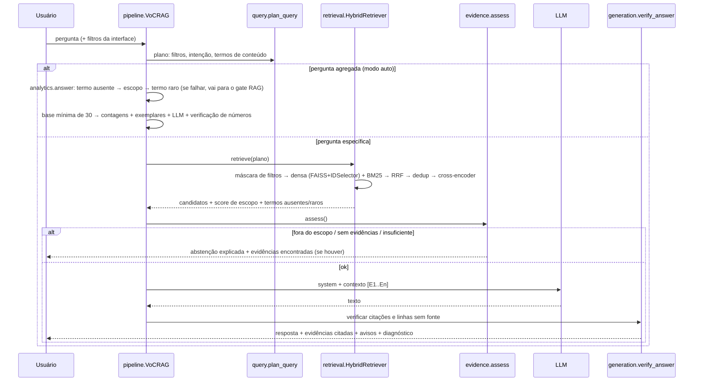

# Arquitetura

## Visão em camadas

| Camada | Responsabilidade | Módulos |
|---|---|---|
| Dados | ler CSVs, juntar tabelas, limpar, mascarar PII, derivar metadados | `data_prep.py`, `text_utils.py` |
| Representação | embeddings (neural ou LSA), índice FAISS, índice BM25, taxonomia de temas | `embeddings.py`, `indexing.py`, `themes.py` |
| Consulta | interpretar a pergunta (filtros, intenção, termos de conteúdo) | `query.py` |
| Recuperação | busca densa + BM25, RRF, deduplicação, re-ranking | `retrieval.py` |
| Controle de evidência | gate de abstenção, montagem de contexto, verificação pós-geração | `evidence.py`, `generation.py` |
| Geração | prompts versionados, provedores de LLM | `prompts.py`, `llm.py` |
| Analítica | contagens por tema, exemplares, síntese verificada | `analytics.py` |
| Orquestração | `VoCRAG.ask()` — roteia entre RAG e analítico | `pipeline.py` |
| Avaliação | calibração, métricas, efeito dos filtros, relatórios, planilhas de auditoria humana | `evaluation.py`, `scripts/04–05, 07, 08` |
| Interface | Streamlit e CLI | `app/streamlit_app.py`, `scripts/perguntar.py` |

## Fluxo de uma pergunta

## Artefatos

| Artefato | Gerado por | Conteúdo |
|---|---|---|
| `artifacts/base/avaliacoes_todas.parquet` | `01_preparar_base.py` | 98.410 avaliações únicas (com e sem texto) + metadados |
| `artifacts/base/documentos.parquet` | `01_preparar_base.py` | 42.138 documentos (avaliações com texto) |
| `artifacts/base/relatorio_preparacao.json` | `01_preparar_base.py` | contagens de cada etapa (linhagem) |
| `artifacts/indice/<modelo>/` | `02_construir_indice.py` | `embeddings.npy`, `faiss.index`, `ids.parquet`, `meta.json` (e `lsa.pkl` no backend LSA) |
| `artifacts/base/temas.parquet`, `temas_resumo.json` | `03_construir_temas.py` | matriz avaliação × tema (booleana) e cobertura por polaridade |
| `eval/auditoria_temas.csv` | `03_construir_temas.py` (só se não existir) | amostra de 15 avaliações por tema para auditoria humana da precisão |
| `artifacts/limiares__<modelo>.json` | `04_calibrar_limiares.py` | limiares do gate + features de calibração |
| `eval/resultados/<modelo>/` | `05_avaliar.py` | CSVs de métricas (inclui `efeito_filtros.csv`), respostas completas em JSON |
| `eval/resultados/comparacao_embeddings.csv` | `07_comparar_embeddings.py` | LSA × MiniLM × e5-small × e5-base |
| `eval/auditoria_fidelidade.csv` | `08_preparar_auditoria_fidelidade.py` (só se não houver anotações) | frases das respostas geradas × evidências citadas, para auditoria humana |

O BM25 é reconstruído ao carregar (alguns segundos), o que evita versionar binários frágeis. O índice valida, ao carregar, que a ordem dos `review_id` coincide com `documentos.parquet`; se a base mudar, ele exige reconstrução.

## Contrato da resposta (`RAGResponse`)

| Campo | Conteúdo |
|---|---|
| `status` | `ok` · `fora_do_escopo` · `sem_evidencias` · `evidencias_insuficientes` · `resposta_nao_fundamentada` |
| `modo` | `rag` ou `analitico` |
| `resposta` | texto verificado (vazio quando há abstenção) |
| `avisos` | mensagens ao usuário (abstenção, natureza da amostra, cobertura da taxonomia...) |
| `evidencias` | `rotulo`, `review_id`, `order_id`, `texto`, `nota`, `data_compra`, `categoria`, `uf`, `situacao_entrega`, `atraso_dias`, scores (denso, BM25, RRF, relevância), `n_textos_identicos`, `citada`, (`tema` no modo analítico) |
| `estatisticas` | (modo analítico) tabela de temas, bases de contagem, cobertura, recorte |
| `plano` | filtros inferidos e justificativas, intenção, termos de conteúdo |
| `diagnostico` | motivo do gate, score de escopo, limiares, modelos, versão do prompt, tempos, resposta crua do LLM, relatório de verificação |
